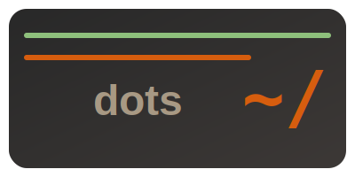

Collection of dotfiles and scripts for my development environment.

- `core/`: minimal dotfiles usable on the server (shell + aliases and minimal vim config)
- `desktop/`: desktop environment with i3, nvim, wezterm etc.. (still not wayland)


## Setting up dotfiles

Install apt packages:
```bash
make apt
```

Symlink dotfiles with stow:
```
make stow
```
