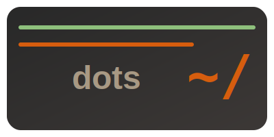

Collection of dotfiles and scripts for my development environment.

The repository:
- installs packages through multiple package managers
- manages dotfiles with stow

It's divided into three 'packages':

- `core/`: minimal dotfiles usable on the server
- `desktop/`: sway desktop environment
- `nvim/`: Neovim installation and configuration


## Setting up dotfiles

All:
```bash
make install
```

For headless/no-desktop setup:
```bash
make install-core install-nvim
```

## Update

```bash
make update
```

For headless/no-desktop setup:
```bash
make update-core update-nvim
```

## Local overrides

Machine-specific shell customizations should live outside the tracked files:

- `~/.bash_aliases_local` for local Bash-compatible aliases/functions.
- `~/.zshrc_local` for local zsh startup such as machine-specific tool paths.

The zsh config only sources these files when they are owned by the current user
and are not group/world writable.
