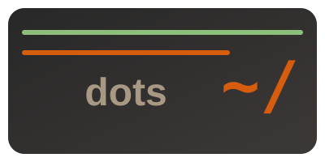

# dots

Small, personal dotfiles for an Ubuntu development machine. GNU Stow owns the
links; the Makefiles install only the packages required by the tracked setup.

- `core/` contains Zsh, Git, tmux-related helpers, and small command-line tools.
- `desktop/` contains the Sway/Wayland setup plus WezTerm and Ghostty configs.
- `nvim/` installs a pinned Neovim release and its plugin configuration.

The supported baseline is Ubuntu 24.04 on x86-64 with APT, `sudo`, and a
systemd user session. The desktop package assumes Sway/Wayland.

## Install

```sh
sudo apt-get update
sudo apt-get install -y git make
git clone https://github.com/Jakub3628800/dots.git ~/repos/dots
cd ~/repos/dots
make install
```

The first core install also creates a Rust toolchain and compiles the few Cargo
tools in `core/Makefile`, so it takes longer than later runs. Existing regular
files are not overwritten by Stow; move any reported conflicts and rerun the
command.

For a machine without the Sway desktop:

```sh
make install-core install-nvim
```

The repository does not replace `~/.profile`. Zsh continues to source the
machine's existing profile when it is a regular file owned by the current user
and is not group/world writable.

## Everyday commands

```sh
make link             # refresh links only
make update           # compatibility alias for `make link`
make upgrade          # reconcile managed packages, Neovim, and links
make system-upgrade   # explicitly upgrade all host APT packages
make clean            # remove managed links
```

`make test` runs the fast script, Stow, Sway, WezTerm, and Neovim config checks.
`make test-bootstrap` performs the slower clean-Ubuntu Docker builds. The full
pre-commit suite can be run with `prek run --all-files`.

## Local choices

Machine-specific settings stay outside the repository:

- `~/.bash_aliases_local` for shell aliases and functions.
- `~/.zshrc_local` for machine-specific paths and shell startup.
- `~/.config/sway/config.local` for Sway variable or input overrides.

Both terminal configs are linked. Sway currently starts WezTerm; the Ghostty
config is available for manual use while the transition is in progress.
WezTerm, Ghostty, Google Chrome, Slack, and 1Password are intentionally not
installed by these Makefiles. Slack and 1Password are started only when found;
install the terminal/browser you use or override the Sway defaults locally.

## SSH agent

Local Zsh shells share a lazily started systemd SSH agent at
`$XDG_RUNTIME_DIR/dots-ssh-agent.socket`. Remote shells preserve a forwarded
agent instead. After login or reboot, load a key once and enter its passphrase:

```sh
ssh-add ~/.ssh/id_ed25519
```

## Included utilities

- `cmd-picker` selects tmux sessions, containers, pull requests, or worktrees.
- `pomo` is an interactive Pomodoro timer. Its database defaults to
  `~/.local/share/pomo/pomo.db`; set `POMO_DB_PATH` to override it.
